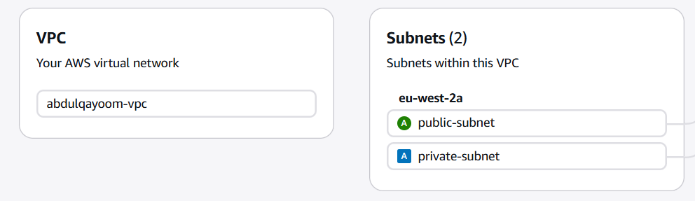

# Assignment 1 – VPC and Networking

## Overview

This assignment demonstrates how to design and deploy a secure AWS network using a custom **Virtual Private Cloud (VPC)** with **public and private subnets**, an **Internet Gateway**, a **NAT Gateway**, and a **bastion host**.
to access the internet from a private EC2 instance. 

The objective is to ensure:

* Public resources can be accessed from the internet
* Private resources remain isolated
* Private instances can still access the internet securely

---

## Architecture

The architecture consists of:

* Custom VPC (`10.0.0.0/16`)
* Public Subnet (`10.0.1.0/24`)
* Private Subnet (`10.0.2.0/24`)
* Internet Gateway (IGW)
* NAT Gateway with Elastic IP
* Bastion Host (public subnet)
* Private EC2 instance (private subnet)
* Separate route tables for public and private subnets

### Architecture Diagram


---

## Step 1 – Create the VPC

A custom VPC was created with the CIDR block:

```
10.0.0.0/16
```


---

## Step 2 – Create Subnets

Two subnets were created in the same Availability Zone:

| Subnet         | CIDR          | Purpose                           |
| -------------- | ------------- | --------------------------------- |
| Public Subnet  | `10.0.1.0/24` | Hosts the Bastion and NAT Gateway |
| Private Subnet | `10.0.2.0/24` | Hosts the private EC2             |



---

## Step 3 – Create and Attach an Internet Gateway

An Internet Gateway was created and attached to the VPC to allow internet access.


---

## Step 4 – Configure the Public Route Table

A route table was created and associated with the public subnet.

| Destination   | Target           |
| ------------- | ---------------- |
| `10.0.0.0/16` | local            |
| `0.0.0.0/0`   | Internet Gateway |


---

## Step 5 – Create NAT Gateway

An Elastic IP was allocated and attached to a NAT Gateway created inside the **public subnet**.


---

## Step 6 – Configure the Private Route Table

A route table was created for the private subnet.

| Destination   | Target      |
| ------------- | ----------- |
| `10.0.0.0/16` | local       |
| `0.0.0.0/0`   | NAT Gateway |


---

## Step 7 – Configure Security Groups

### Bastion Host Security Group

Inbound:

* SSH (22) from **my public IP**

Outbound:

* All traffic


### Private EC2 Security Group

Inbound:

* SSH (22) from **Bastion Security Group**

Outbound:

* All traffic


---

## Step 8 – Launch EC2 Instances

### Bastion Host

* Subnet: Public Subnet
* Public IP: Enabled
* Security Group: Bastion-SG
* Key Pair: `assignment1`


### Private EC2

* Subnet: Private Subnet
* Public IP: Disabled
* Security Group: Private-EC2-SG
* Key Pair: `assignment1`


